# mt-centrallog Lite

Self-hosted MikroTik central logging with rule-based threat detection, auto block/unblock, MNDP network map, Network Topology Mapper, device backup/restore, and Telegram + email alerting. Docker Compose, SQLite, single-node.

> **Repo status:** this repository ships the **installer + pre-built Docker images only**. The source lives in the private full repo. Everything here is what `install.sh` needs and what `docker compose pull` fetches.

## Videos

https://www.youtube.com/watch?v=5XYOWSiuobE

## Screenshots

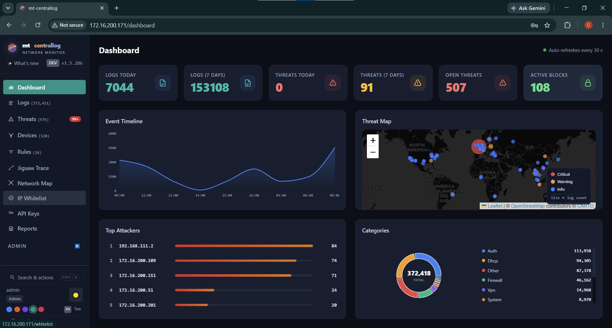
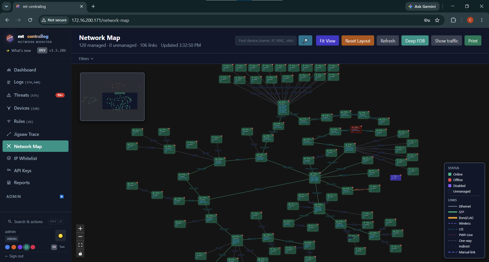
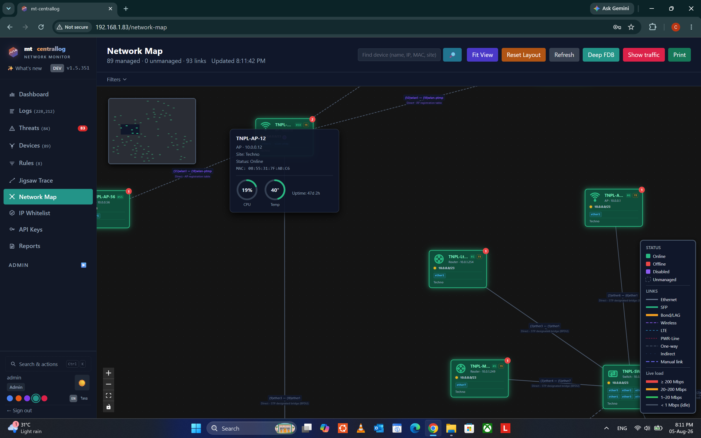
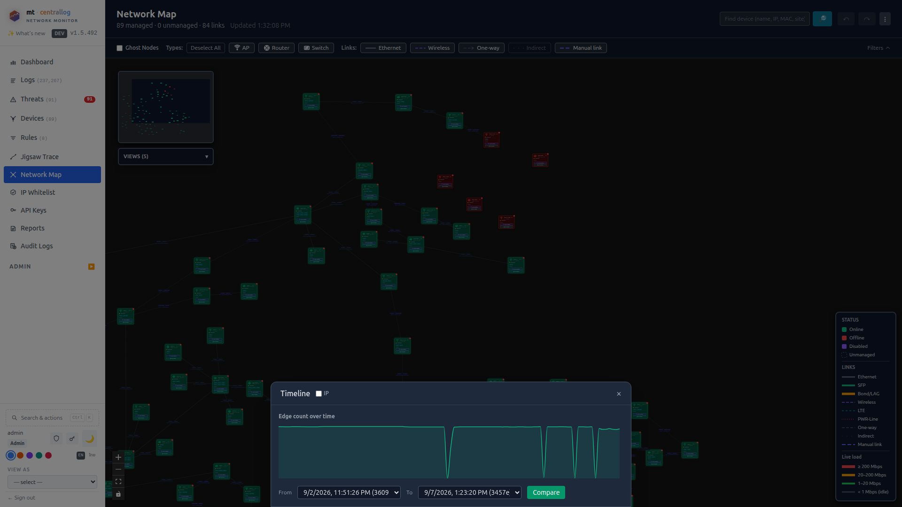
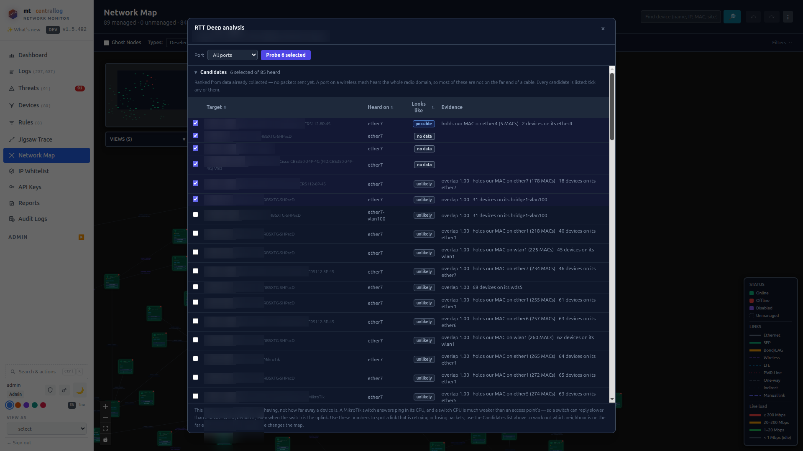
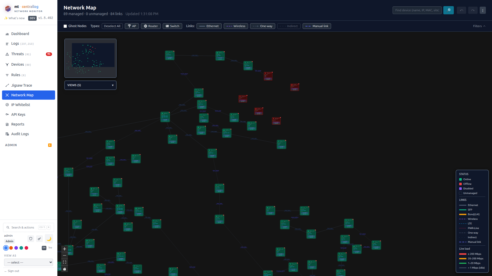
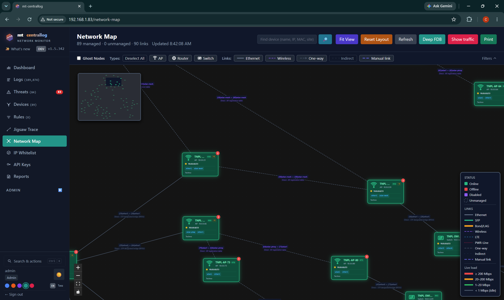
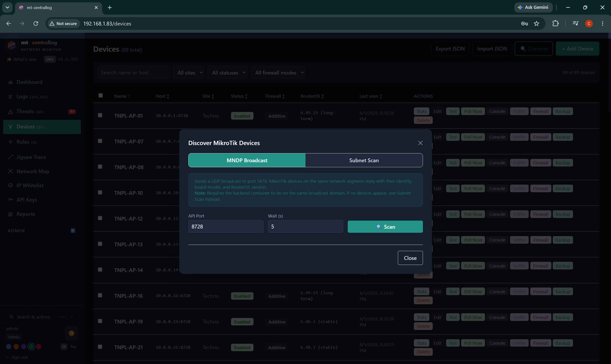
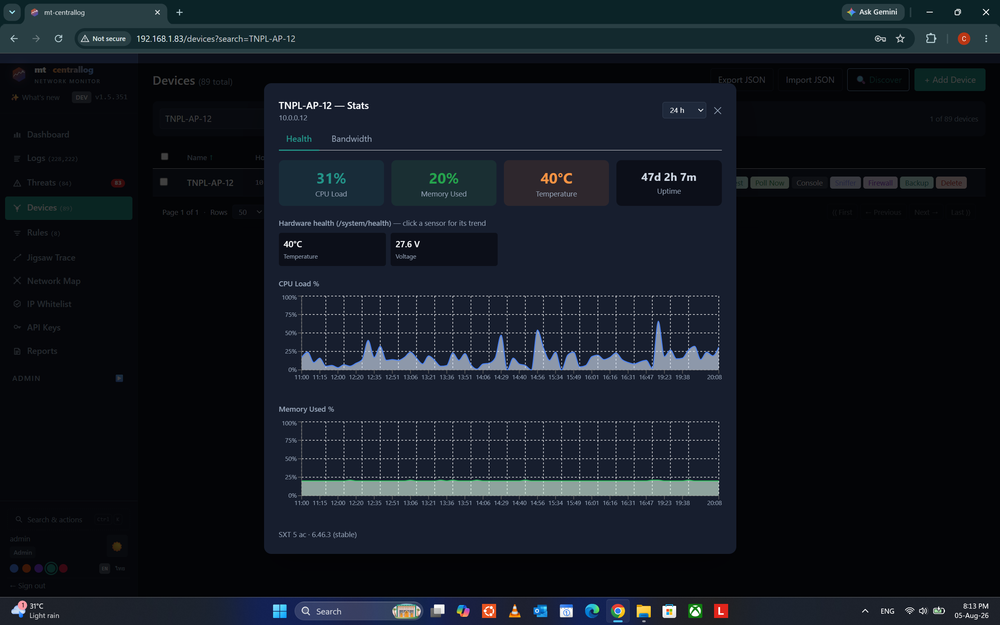
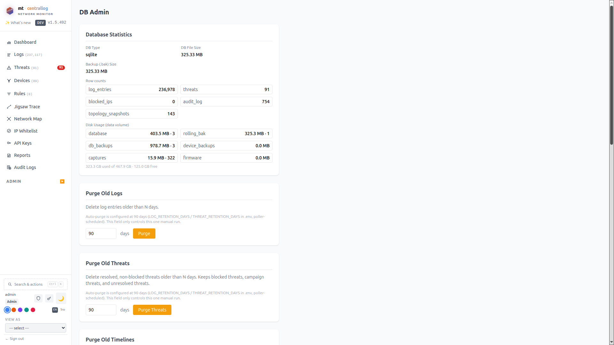
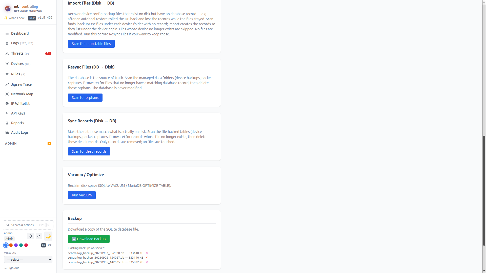
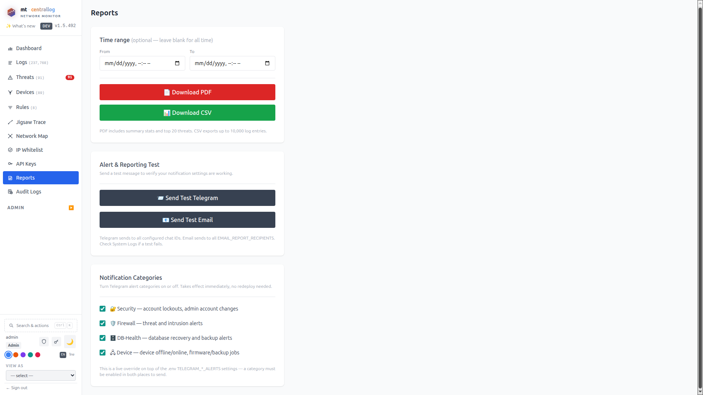
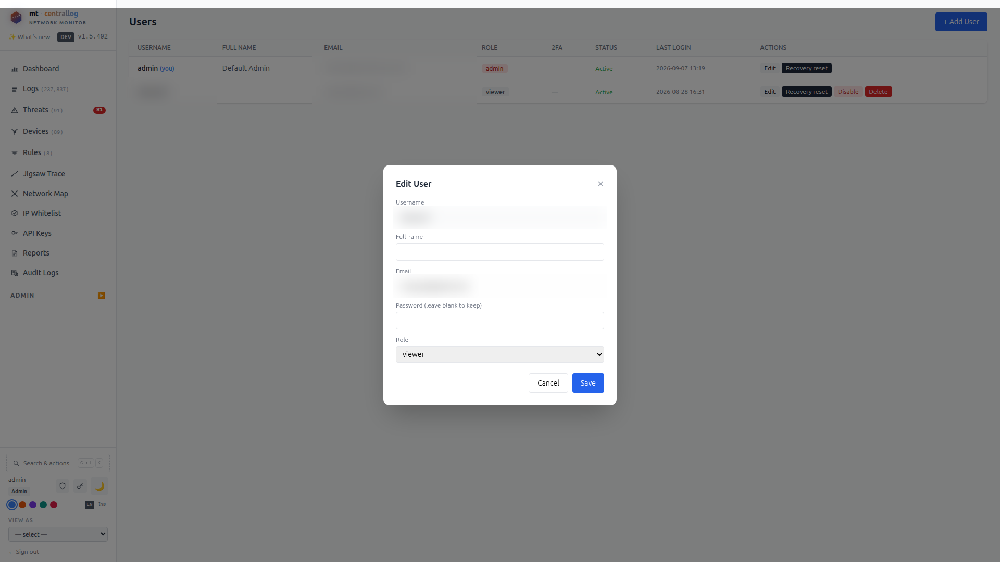
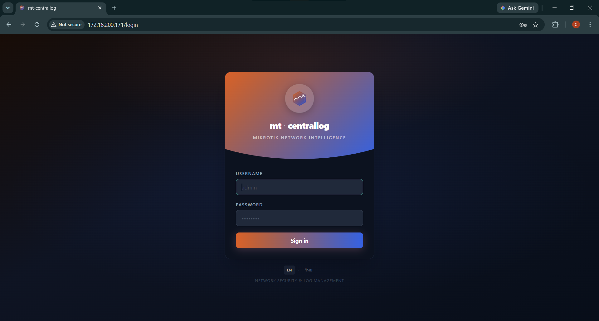

## Quick install

```bash
curl -fsSL https://raw.githubusercontent.com/cluangar/mt-centrallog-lite/main/install.sh | bash
```

That single command:
1. Checks Docker + Compose v2 are available.
2. Auto-detects your LAN interface / subnet / gateway.
3. Downloads the compose file + `.env.example` into `~/mt-centrallog-lite/`.
4. Generates a strong `SECRET_KEY` and internal `BACKEND_API_KEY`.
5. Runs `docker compose pull && docker compose up -d`.

When it finishes: browse to `http://<your-server-ip>/` — default login **admin / admin1234** (change it on first login).

## Requirements

- Linux host (amd64). Tested on Debian 12, Ubuntu 22.04 / 24.04.
- Docker Engine 24+ with Compose plugin (`docker compose version` must work).
- Free TCP ports 80 + 443 (override via `WEB_HTTP_PORT` / `WEB_HTTPS_PORT` in `.env`).
- A LAN interface reachable by your MikroTik devices (needed for MNDP broadcast discovery).

## Update

```bash
cd ~/mt-centrallog-lite
./update.sh              # pull :latest and recreate
./update.sh 1.5.290      # pin to a specific version (writes IMAGE_TAG to .env)
./update.sh --refresh    # also re-download compose file + update-mndp.sh
```

Your `sqlite_data/`, `backup_data/`, `capture_data/`, and `.env` are never touched by an update — only images swap.

Any database schema change a release needs is applied automatically the first time the new backend image starts — there's no separate migration step to run.

## Change LAN settings

If auto-detect picked the wrong interface, or your LAN moved:

```bash
cd ~/mt-centrallog-lite
./update-mndp.sh         # interactive prompts for MNDP_* + BACKEND_FETCH_URL
docker compose down && docker compose up -d    # recreate the macvlan_lan network
```

## Uninstall

```bash
cd ~/mt-centrallog-lite
./uninstall.sh              # stops stack, prompts before deleting data
./uninstall.sh --keep-data  # keeps sqlite_data/ backup_data/ capture_data/
```

## What's inside

Five containers pulled from GHCR:

| Image | Purpose |
|---|---|
| `ghcr.io/cluangar/mt-centrallog-lite-backend` | FastAPI + SQLAlchemy async, REST API, threat engine, auto block/unblock |
| `ghcr.io/cluangar/mt-centrallog-lite-poller` | librouteros polling loop, MNDP scanner, DHCP/DNS/lease scraper |
| `ghcr.io/cluangar/mt-centrallog-lite-frontend` | React SPA (Vite build) |
| `ghcr.io/cluangar/mt-centrallog-lite-nginx` | Reverse proxy, self-signed cert on first boot |
| `ghcr.io/cluangar/mt-centrallog-lite-mndp-relay` | UDP host-relay so containers see MNDP broadcasts |

Plus one sidecar not built by us: `tecnativa/docker-socket-proxy:0.3` (narrows the backend's Docker access to `/containers/*` + `/images/*` — needed for the Service Status page and post-restore auto-restart).

## Features

**Included in Lite:**
- Multi-device MikroTik log collection over the RouterOS API
- Rule-based threat detection + Level-1 auto block/unblock
- Risk scoring, GeoIP threat map
- MNDP network map with save-device-position
- Binary `.backup` save + plain restore
- Full hardware-health panel (temp / voltage / current / fans across CCR/CRS/RB)
- Telegram + email alerting
- English + Thai UI
- DHCP / DNS name-lookup (partial UDT — resolves hostname → IP / MAC)
- Full security-hardening pass (SECRET_KEY startup gate, login rate limit, security headers, upload caps, SSH host-key learn-and-verify, docker-socket-proxy sidecar)
- Automatic database protection — scheduled rolling + timestamped backups taken live without disturbing the running database, integrity-verified so damage is never copied into a backup, plus startup auto-heal that promotes the newest good backup if the database is unusable

**Not in Lite (available in the Full edition):**
- AI pattern detection, adaptive rules, predictive blocking
- SNMP topology (FDB, LLDP, Q-bridge, CapsMan wireless-flood demote)
- UDT switch-port locate (which switch + port an IP/MAC is on)
- `.rsc` reset-first restore with rescue bootstrap + assisted recovery
- RouterOS firmware upgrade/downgrade jobs
- Bulk CLI runner
- MariaDB backend, MCP server, AR Port Map API
- AbuseIPDB / Tor/Proxy reputation enrichment

Lite and Full share the same DB schema and the same `.env` format — Lite → Full upgrade is a Docker image swap.

## License

TBD. Do not redistribute without permission until this section is filled in.

## Support

Issues + questions: [github.com/cluangar/mt-centrallog-lite/issues](https://github.com/cluangar/mt-centrallog-lite/issues)
