# mt-centrallog Lite

Self-hosted MikroTik central logging with rule-based threat detection, auto block/unblock, an MNDP network map with switch-port locate, one-click device WebFig console, device backup/restore (binary and reset-first `.rsc`), per-AP wireless client monitoring, and Telegram + email alerting. Docker Compose, SQLite, single-node.

**Current release: `1.5.561`** — `:latest` and `:1.5.561` are the same images on GHCR (pushed 2026-10-07: the Network Map load-failure diagnostics + the nginx `gzip_proxied any` compression fix; backend / poller / mndp-relay images are byte-identical to `1.5.558`).

> **Repo status:** this repository ships the **installer + pre-built Docker images only**. The source lives in the private full repo. Everything here is what `install.sh` needs and what `docker compose pull` fetches.

## Videos

https://www.youtube.com/watch?v=5XYOWSiuobE

## Screenshots

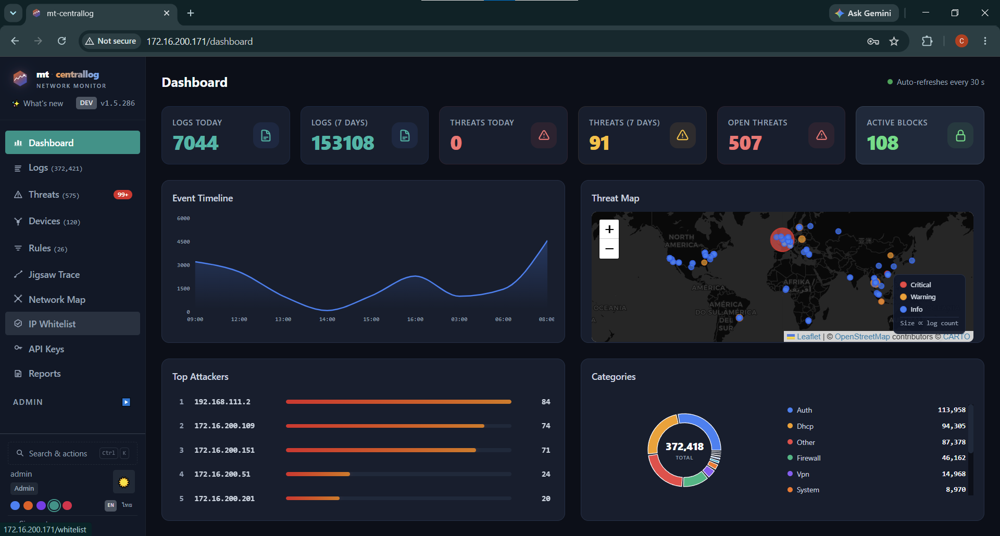
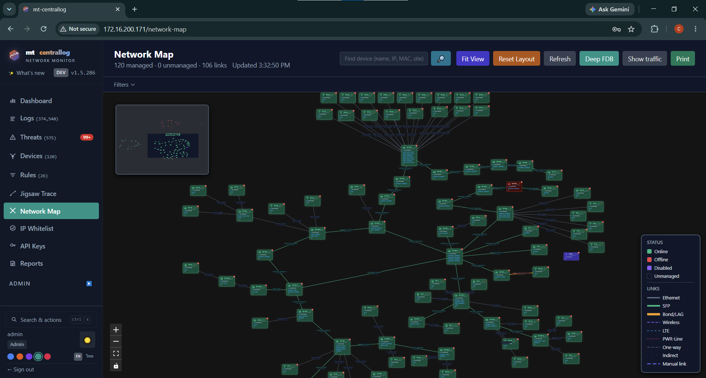
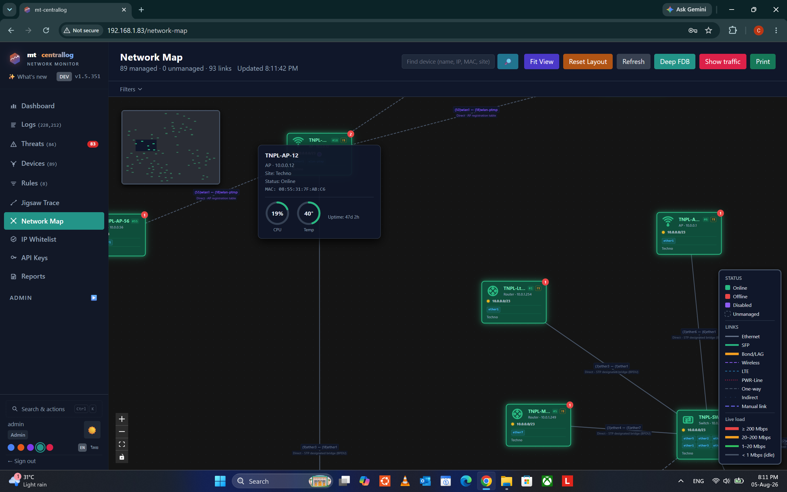
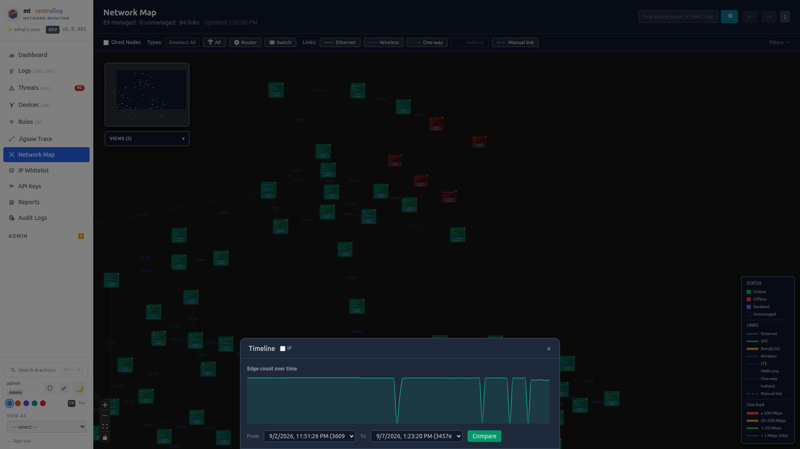
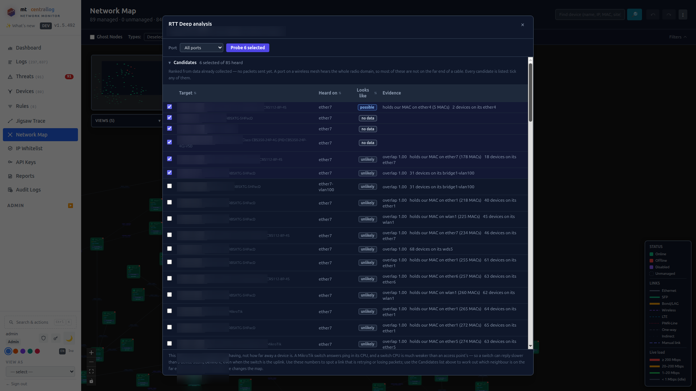
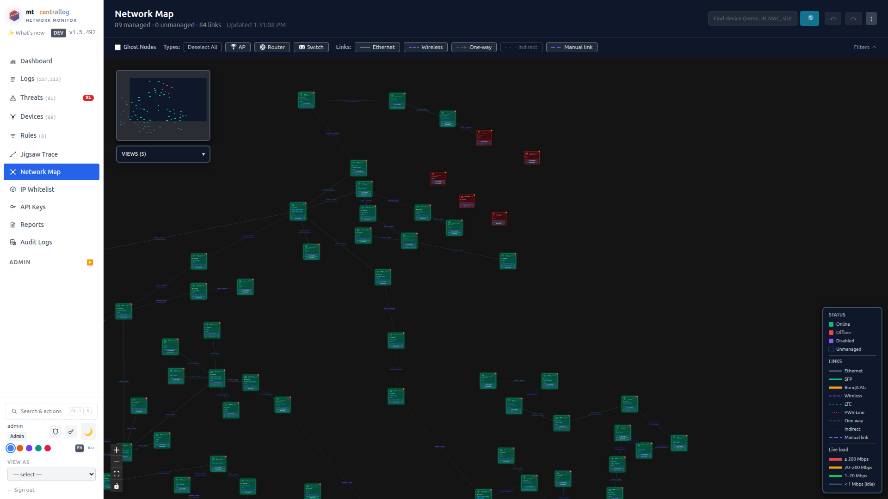
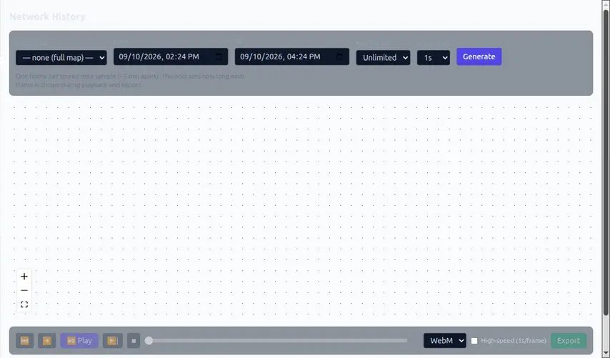
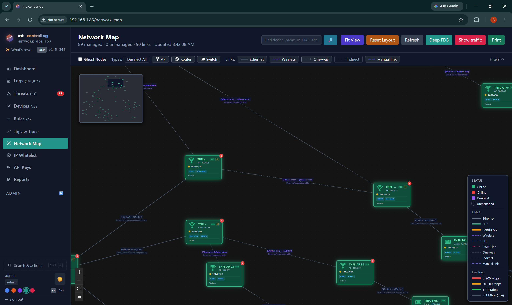
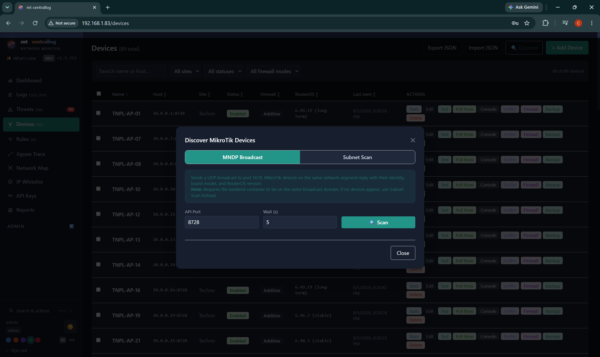
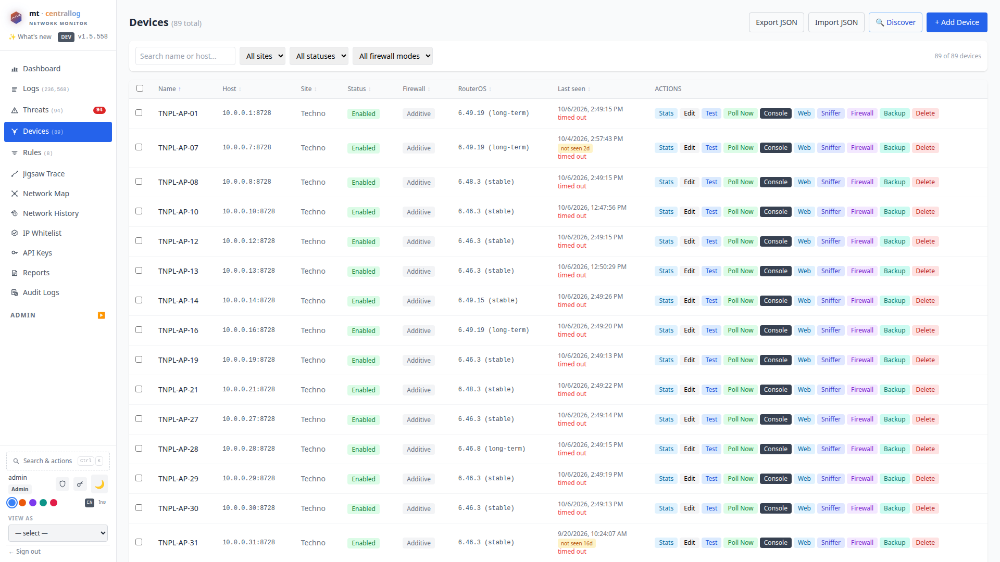
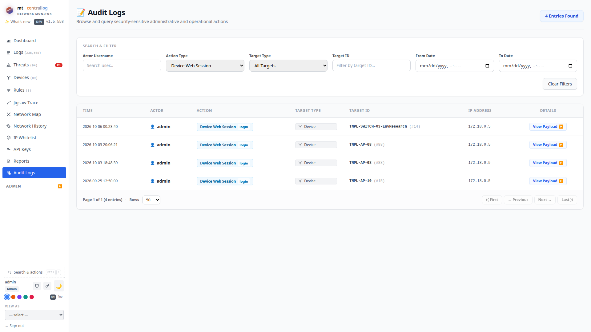
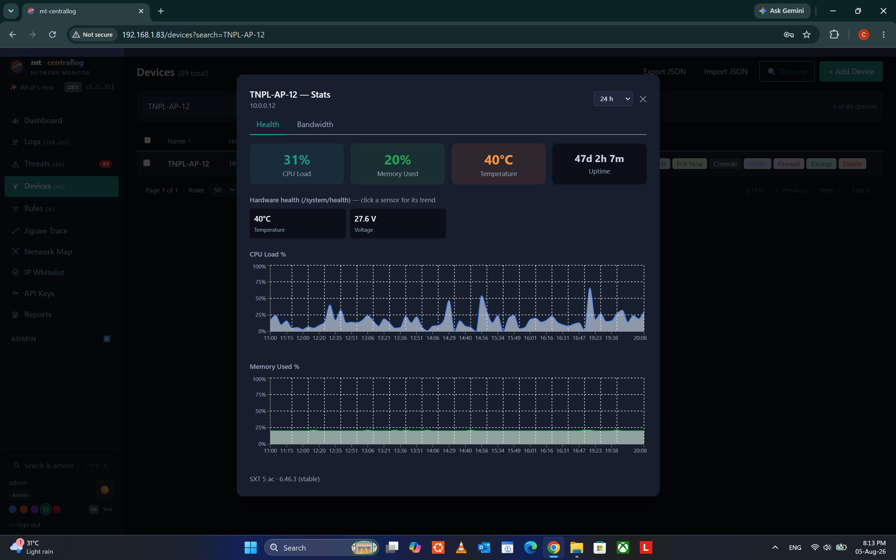
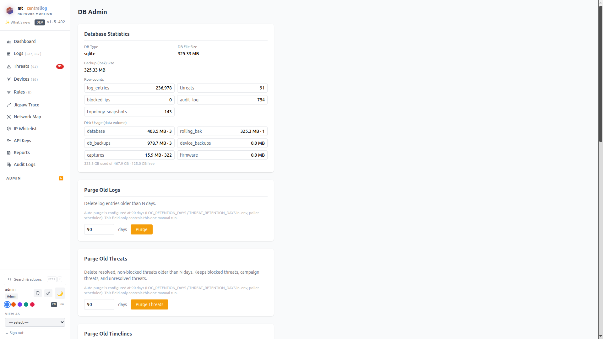
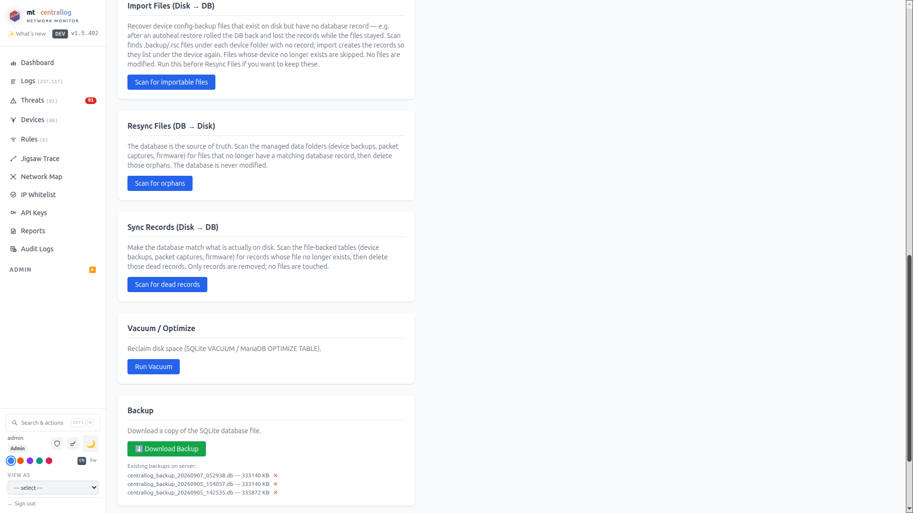
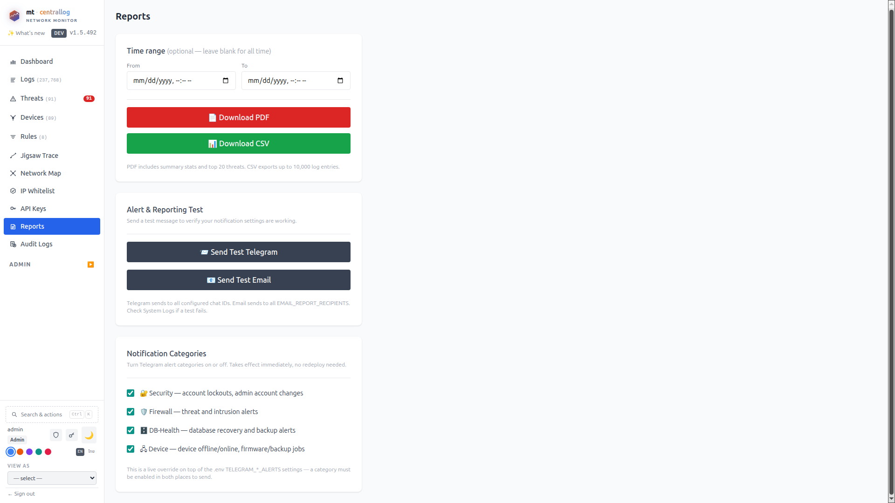
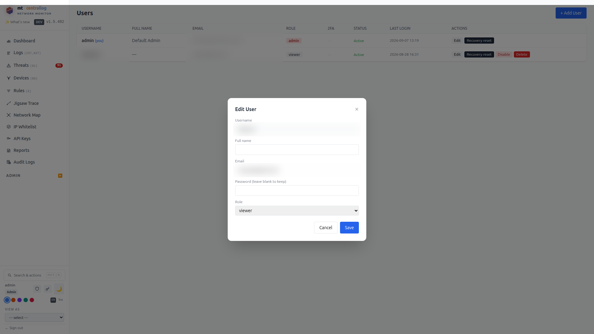
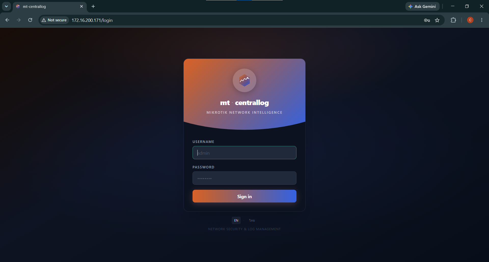

## Quick install

```bash
curl -fsSL https://raw.githubusercontent.com/cluangar/mt-centrallog-lite/main/install.sh | bash
```

That single command:
1. Checks Docker + Compose v2 are available.
2. Auto-detects your LAN interface / subnet / gateway.
3. Downloads the compose file + `.env.example` into `~/mt-centrallog-lite/`.
4. Generates a strong `SECRET_KEY` and internal `BACKEND_API_KEY`.
5. Runs `docker compose pull && docker compose up -d`.
6. Schedules the host **DB watchdog** in your crontab (every 10 min) — see [Database protection](#database-protection).

When it finishes: browse to `http://<your-server-ip>/` — default login **admin / admin1234** (change it on first login).

## Requirements

- Linux host (amd64). Tested on Debian 12, Ubuntu 22.04 / 24.04.
- Docker Engine 24+ with Compose plugin (`docker compose version` must work).
- Free TCP ports 80 + 443 (override via `WEB_HTTP_PORT` / `WEB_HTTPS_PORT` in `.env`), plus 8071–8080 for the one-click device WebFig console (fixed, up to 10 concurrent windows).
- A LAN interface reachable by your MikroTik devices (needed for MNDP broadcast discovery). The ipvlan parent is `MNDP_PARENT_IFACE` (default `eth0`; set it to `wlan0`/`wlo1` on a Wi-Fi host).

## Update

```bash
cd ~/mt-centrallog-lite
./update.sh              # pull :latest and recreate
./update.sh 1.5.561      # pin to a specific version (writes IMAGE_TAG to .env)
./update.sh --refresh    # also re-download compose file + update-mndp.sh
```

Your `sqlite_data/`, `backup_data/`, `capture_data/`, and `.env` are never touched by an update — only images swap.

Any database schema change a release needs is applied automatically the first time the new backend image starts — there's no separate migration step to run.

## Change LAN settings

If auto-detect picked the wrong interface, or your LAN moved:

```bash
cd ~/mt-centrallog-lite
./update-mndp.sh         # interactive prompts for MNDP_* + BACKEND_FETCH_URL
docker compose down && docker compose up -d    # recreate the macvlan_lan network
```

## Uninstall

```bash
cd ~/mt-centrallog-lite
./uninstall.sh              # stops stack, prompts before deleting data
./uninstall.sh --keep-data  # keeps sqlite_data/ backup_data/ capture_data/
```

## What's inside

Five containers pulled from GHCR:

| Image | Purpose |
|---|---|
| `ghcr.io/cluangar/mt-centrallog-lite-backend` | FastAPI + SQLAlchemy async, REST API, threat engine, auto block/unblock |
| `ghcr.io/cluangar/mt-centrallog-lite-poller` | librouteros polling loop, MNDP scanner, DHCP/DNS/lease scraper |
| `ghcr.io/cluangar/mt-centrallog-lite-frontend` | React SPA (Vite build) |
| `ghcr.io/cluangar/mt-centrallog-lite-nginx` | Reverse proxy, self-signed cert on first boot |
| `ghcr.io/cluangar/mt-centrallog-lite-mndp-relay` | UDP host-relay so containers see MNDP broadcasts |

Plus one sidecar not built by us: `tecnativa/docker-socket-proxy:0.3` (narrows the backend's Docker access to `/containers/*` + `/images/*` — needed for the Service Status page and post-restore auto-restart).

## Features

**Included in Lite:**

*Logging & threats*
- Multi-device MikroTik log collection over the RouterOS API
- Rule-based threat detection (detection-rule CRUD) + automatic block/unblock into a `centrallog-blocked` address list
- IP whitelist management, including dynamic-DNS tracking of a whitelisted hostname
- Risk scoring (0–100, severity + recidivism + subnet concentration) with automatic escalation, GeoIP threat map
- Per-threat trace (what the device actually did) and a full audit log of every operator action
- Logs / Threats / Rules / Whitelist / Trace / Audit pages, system-log viewer, service-status page, API keys for machine access

*Network map & discovery*
- MNDP network map: saved device positions, named views, undo/redo for moves, links, resets and views, Ctrl+K command palette
- UDT **locate** — resolve an IP / MAC / hostname to the **switch and port** it is on, ranked best-first; hostname resolution runs through DHCP leases, static/cached DNS, and a live router probe
- Live per-link traffic load colouring, stale-link badging, per-port chips on the device card
- Link-count timeline with A/B compare, and **Network History**: traffic replay over a time window with video export (WebM / MP4 / AVI)
- Per-device map tools: **Force update** (re-poll one device on demand and report the uplink it found) and **RTT deep probe** (ICMP path-quality classification to the neighbours heard on its ports)
- What-if view: `?mute=9,12` redraws the map as if those devices were gone, without touching them
- Device discovery by MNDP broadcast or by TCP subnet scan, with SNMP enrichment

*Wireless*
- PtMP / mesh / WDS links drawn from each AP's own registration table (no controller required)
- Per-band (2.4 / 5 / 6 GHz) + per-SSID client counts on the map and in the device's Wireless tab, with per-client signal (dBm) and tx/rx rate
- Weak / poor-signal surfacing per AP, overloaded-AP chip on the map, and per-AP client-count history charted over time
- Client manufacturer badges from the IEEE OUI registry (offline lookup)

*Devices*
- Binary `.backup` save + restore (exact, reboots the device)
- `.rsc` save + restore in **both** modes: fast `/import`, and **reset-first** restore with a rescue bootstrap so the device always comes back reachable on its current management IP — plus assisted recovery hints (locate-by-MAC via neighbours) when it does not
- Multi-IP / multi-VLAN device records, self-IP and managed-device protection so the app never blocks itself, firewall-rule resync between DB and device
- Full hardware-health panel (temperature / voltage / current / fans across CCR / CRS / RB), interface + uptime + CPU/memory history
- One-click **WebFig console** from a device row (the **Web** button, plus the open icon in the Console modal) — a ticket-gated auto-logged-in session, up to 10 concurrent windows on ports 8071–8080, with every open / login / close written to the audit log

*Alerting*
- Telegram: threat alerts, device offline/back-online, job completion, database health, and a periodic digest; quiet hours and alert-storm coalescing; optional inline Block / Whitelist / View buttons (off by default, acted on only from the chats alerts are sent to)
- Email: report delivery, forgot-password reset, 2FA recovery codes
- A per-category checklist on the Reports page (Security / Firewall / DB-Health / Device) to mute a category without editing `.env`

*Accounts & security*
- Roles `viewer < analyst < operator < admin`, per-endpoint enforcement, admin "view as" preview, TOTP 2FA with one-time recovery codes, self-service password change and email password reset, login rate limiting + lockout with security alerts
- `SECRET_KEY` startup gate, security headers, upload caps, SSH host-key learn-and-verify, docker-socket-proxy sidecar instead of a raw `docker.sock` mount
- English + Thai UI

*Database protection*
- Scheduled rolling backups every `DB_BACKUP_INTERVAL_HOURS` (default 4) plus the timestamped ones you take from DB Admin — written **without disturbing the running database** (SQLite online-backup API, read-only sources) and integrity-verified, so a corrupt page is never copied into a backup
- **Opt-in** startup auto-heal — `DB_AUTOHEAL_ENABLED=true` (the shipped template sets `false`; turn it on especially on SD / eMMC / USB storage) — which promotes the newest clean, non-empty backup when the database is unusable
- DB Admin page: backup/restore (restore is staged, applied safely at next start), purge, vacuum, disk-usage breakdown, and a data-hygiene suite that reconciles DB rows with the files actually on disk (import orphan device backups, drop rows whose file is gone, delete files with no row)
- Host **DB watchdog** (`db_watchdog.sh`, cron every 10 min) — see below

**Not in Lite (available in the Full edition):**
- AI pattern detection, adaptive rule proposals, predictive pre-blocking
- SNMP network-topology mapping (FDB / LLDP / Q-Bridge / CapsMan), SNMP device discovery and the SNMP settings page
- Continuous subnet host scanning (`scanned_hosts`) — Lite's locate resolves from DHCP/DNS and live router probes
- RouterOS firmware upgrade/downgrade jobs (including optional-package staging)
- Bulk CLI runner
- Wireless analysis page (fleet-wide load + weak-signal table)
- MariaDB backend option, MCP server, AR Port-Map API
- AbuseIPDB / Tor / proxy reputation **lookups** — Lite's risk scorer reads the reputation table (`risk_scorer.py:91`) and scores it if rows exist, but Lite ships no reputation service to fill it
- Ramdisk database mode

Lite and Full share the same DB schema and the same `.env` format — Lite → Full upgrade is a Docker image swap.

## Database protection (host watchdog)

`install.sh` and `update.sh` place three scripts next to your stack and add one crontab entry (`*/10`):

| Script | Role |
|---|---|
| `db_watchdog.sh` | the single command: `install` · `remove` · `status` · (no argument) run one check |
| `watchdog-cron.sh` | manages the crontab entry only |
| `recover_db.sh` | deep repair — auto-elevates with sudo when it needs it |

It checks the database two ways (a read-only `integrity_check` **and** the backend's own error log), keeps verified snapshots and per-incident forensics in `.watchdog/`, and — when `DB_WATCHDOG_AUTORECOVER=true` — stops both writers, heals the backend, then restarts the poller. Repeated failures trip a circuit breaker that stops auto-retrying until a human looks; clear it with `./db_watchdog.sh rearm`.

- It runs **as you**, not root, and never resurrects a stack you deliberately stopped.
- It is opt-in for unreliable storage (SD / eMMC / USB): `DB_WATCHDOG_ENABLED=false` by default, set it `true` on those disks.
- Telegram pings for watchdog events follow the **DB-Health** category on the Reports page plus `TELEGRAM_DB_ALERTS`.

Manual checks: `./db_watchdog.sh status` · `crontab -l | grep watchdog`. Remove it with `./watchdog-cron.sh remove` (or `./uninstall.sh`).

## Tunables worth knowing

Everything lives in `.env` and `docker compose up -d` re-reads it. A few are worth naming:

| Key | Value in `.env.example` | What it does |
|---|---|---|
| `LOG_RETENTION_DAYS` / `INTERFACE_STATS_RETENTION_DAYS` / `THREAT_RETENTION_DAYS` | see `.env` | how far back logs, per-interface traffic samples and threats are kept |
| `WIRELESS_WEAK_SIGNAL_DBM` / `WIRELESS_POOR_SIGNAL_DBM` | `-75` / `-85` | the weak / poor client thresholds |
| `WIRELESS_OVERLOAD_CLIENT_COUNT` | `30` | how many associated clients turn an AP's map chip amber |
| `WIRELESS_FRESHNESS_MINUTES` | `60` | how old a client sample may be before it is dropped from the counts — must outlive one full poll pass of your fleet |
| `WIRELESS_STATS_SAMPLE_INTERVAL_MINUTES` | `15` | cadence of the per-AP client-count history behind the device chart |
| `TOPOLOGY_SNAPSHOT_INTERVAL_S` / `TOPOLOGY_SNAPSHOT_RETENTION_DAYS` | `900` / `3` (code defaults `15` / `90`) | link-count timeline capture tick + retention |
| `TELEGRAM_*` | see `.env` | which alert types are sent, digest interval, quiet hours, inline buttons |
| `DB_WATCHDOG_*` / `DB_AUTOHEAL_ENABLED` | see `.env` | the host watchdog and startup auto-heal |

⚠ Changing a value needs `docker compose up -d` (a **recreate**), not `docker compose restart` — a restart does not re-read `.env`.

## License

TBD. Do not redistribute without permission until this section is filled in.

## Support

Issues + questions: [github.com/cluangar/mt-centrallog-lite/issues](https://github.com/cluangar/mt-centrallog-lite/issues)
